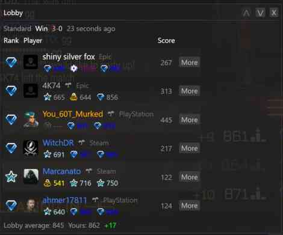
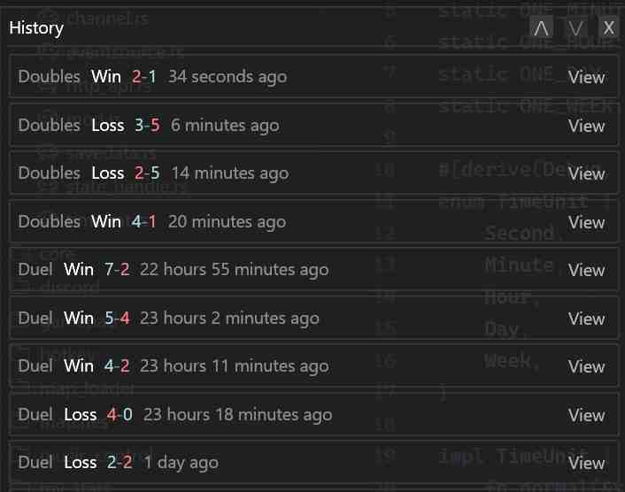
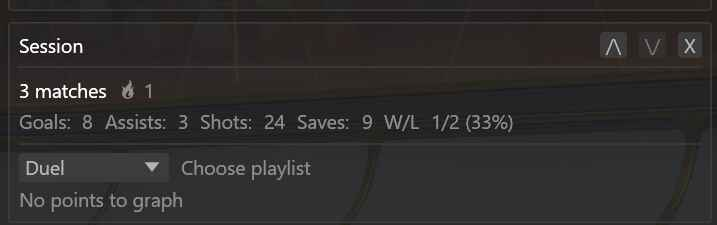
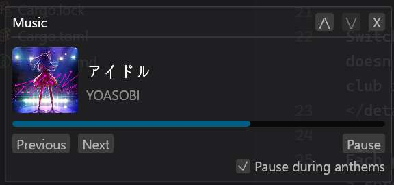
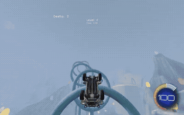
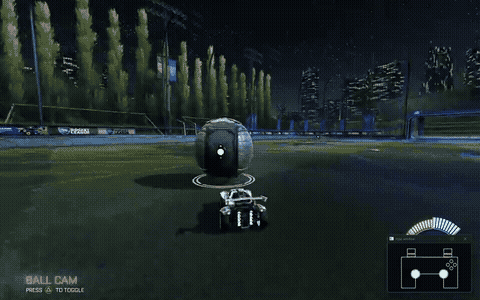
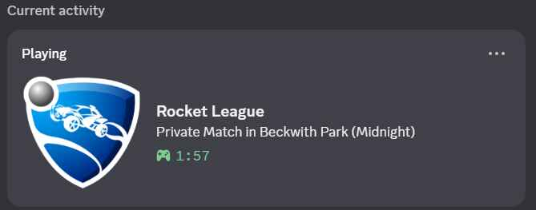
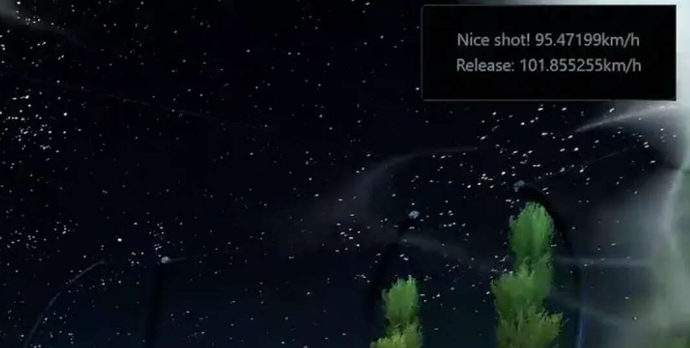
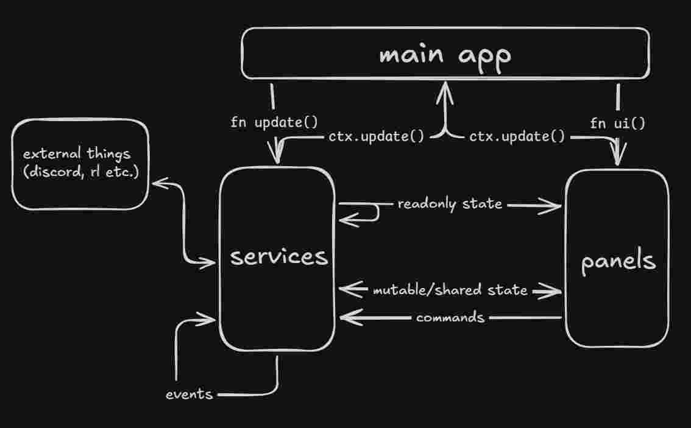

# rlbuddy

- [Check out rlbuddy's development journey on Stardance!](https://stardance.hackclub.com/projects/25644)
- rlbuddy is 100% sleep-deprived-humanslop. Little to no AI was used in its making!

rlbuddy is a Rocket League companion app for Windows that lets you preview your lobby's ranks without tabbing out,
offers various statistics based on your match history, and has a bunch of widgets allowing for Discord rich presence,
automatic music control, player stats, custom map loading, and more!

Each feature has its own widget, so you can customize it to your heart's desire :)

## Installation

Go to the [latest release](https://github.com/kalilamodow/rlbuddy/releases/latest), open the Assets dropdown, and
download rlbuddy.exe. It's self-contained and stores data in the user appdata directory, so you can put the executable
wherever you want and it'll work.

If you've never turned on the stats api before, on first run, make sure to enable it with the Stats API Setup widget.
It's open by default.

## Features

### Lobby

This is the main widget that you'll probably look at. It lists each player along with their comp 1s, 2s, and 3s ranks,
and puts their rank in whatever mode you're currently playing on the left. It also uncensors their name automatically,
and shows their platform next to their name. It also shows each player's avatar if they're on Steam, Xbox, or
PlayStation.

By default, it sources rank/name information from the game's API itself, so no Tracker is required, but you can click
their name to open their Tracker profile. It attempts to fully resolve Switch player ids, but it's only guaranteed to be
right if they're in a club.

    
"Only guaranteed if they're in a club? That seems... arbitrary."

Switch names aren't unique, so usually, just putting a player's name into tracker.gg doesn't work. It also doesn't
accept their platform id, for some reason. So, rlbuddy uses a special lookup using the player's club information to get
their Epic id, which TRN can serve information for.

Each player also gets some badges based on how they've played with you before! By default, each player has a sprout icon
if it's your first time meeting them. However, there are also badges for games won together as well as how well you've
played against them!

### Match history

This widget lets you peruse previous matches at your leisure. Matches that aren't part of the current session have a
more stripped down view as to not waste space.

### Session Stats

This widget gives a quick glance as to your current session's stats (eg. goals, winrate, MMR change). There's also a
per-playlist MMR graph, which is pretty cool.

### Music

You can control your music straight from the overlay, like skipping a song. It also allows you to automatically pause
your music while anthems are playing, kind of like the builtin Rocket Radio. It asks Windows for music data, so anything
that shows up in the Action center should also show up in rlbuddy.

rlbuddy used to integrate with Spotify, but it was pretty annoying, so it now interfaces directly with Windows. It's a
lot faster this way as well.

### Custom map loader

You can import custom maps within rlbuddy. It replaces Underpass, so to play a custom map just load it and then play
Underpass in training. If you want to actually play underpass again, you can just unload the map.

Additionally, you can download + import them straight from Bakkesplugins in the app as well.

### Gamepad overlay

rlbuddy can also show a gamepad overlay window that always stays on top of the game window. It only includes
commonly-used bindings. It'll save its window position, so you don't need to move it to the right place every time.

### Discord rich presence

rlbuddy can now show Rich Presence in Discord, so now all your friends can see you destroying your opponents ;)

Of course, you can disable it or just hide the current score.

### Hotkey

rlbuddy is usually opened with a hotkey/controller button, so you don't have to go through the taskbar or alt tab or
anything. It kind of just pops up on top of the game window.

The supported keyboard hotkeys are:

- Alt (default)
- Left shift
- Left control
- Tab
- Windows/Super

It also has controller buttons, being:

- Options (default)
- Start
- Left bumper
- Right bumper

It stays up as long as you are holding the hotkey or while the window stays in focus. It's also disable-able.

### Match toasts

This actually isn't a widget, but toggleable default behaviour. When you score a goal or hit the crossbar, it'll tell
you the release velocity (how hard you shot it) as well as how fast the goal/hit was. This is useful in training when
you're practicing pinches or hard flicks and don't want to wait for the goal replay to check the speed. You can make it
only appear in training.

### Automatic setup

rlbuddy uses the stats api to get game information, and it can automatically set up the Rocket League stats api for you
that way you don't have to manually edit the ini. The automatic setup widget is shown by default on first open.

### Automatic popup-ing

It automatically pops up (without taking away focus) in front of the game when a match starts until kickoff so you don't
have to open it manually.

### Other

rlbuddy can be partially transparent. You can adjust the opacity through the settings widget.

## Current roadmap

- Custom/workshop map downloader
- Controller overlay

## Development/project architecture

rlbuddy is written in Rust and uses the `eframe` gui framework. The build script automatically downloads assets from the
Fandom images server. It does use a couple of Windows-only features, but Linux support is totally possible if enough
people want it (I'm on Windows so I'm not totally sure what works on other platforms).

There are services and panels. Services are the code-behind, they're state managers with `update` methods called every
tick. They usually connect to external programs (discord, rocket league, etc.) to give rlbuddy information. They're
composable, so for example the Discord service relies on the Stats API service to show data from the game. Panels are
basically named `egui::Widget`s and take service state handles/command senders.

I made a basic diagram explaining their relationships.

Here are some examples:

- Music panel reading the current playback state from the music control service
- Stats api service emitting events to the music service to play/pause during goal replay
- Discord service talking to discord over ipc
- Player info widget sending the OpenPlayerInfo command to the player info service
- Lobby widget also sending OpenPlayerInfo when a player name is clicked
